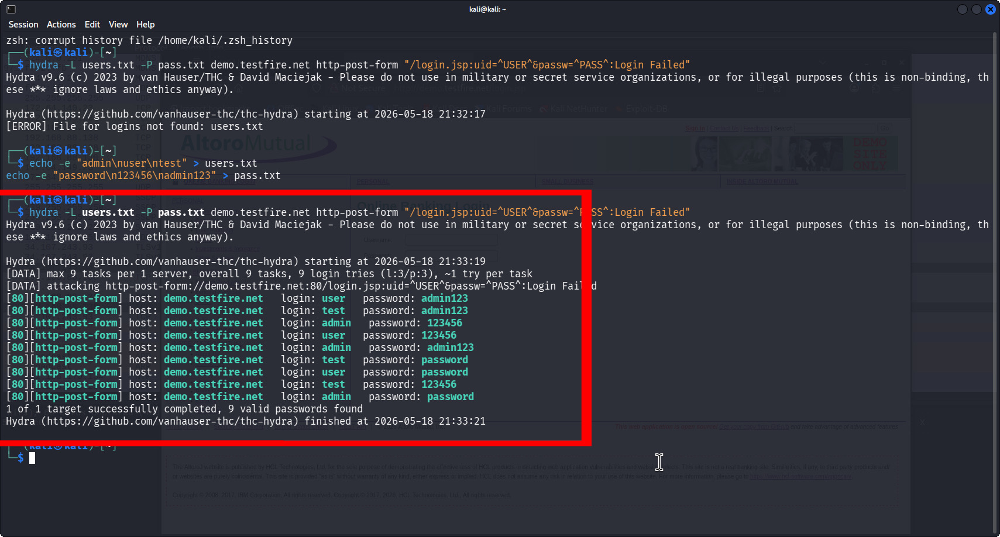
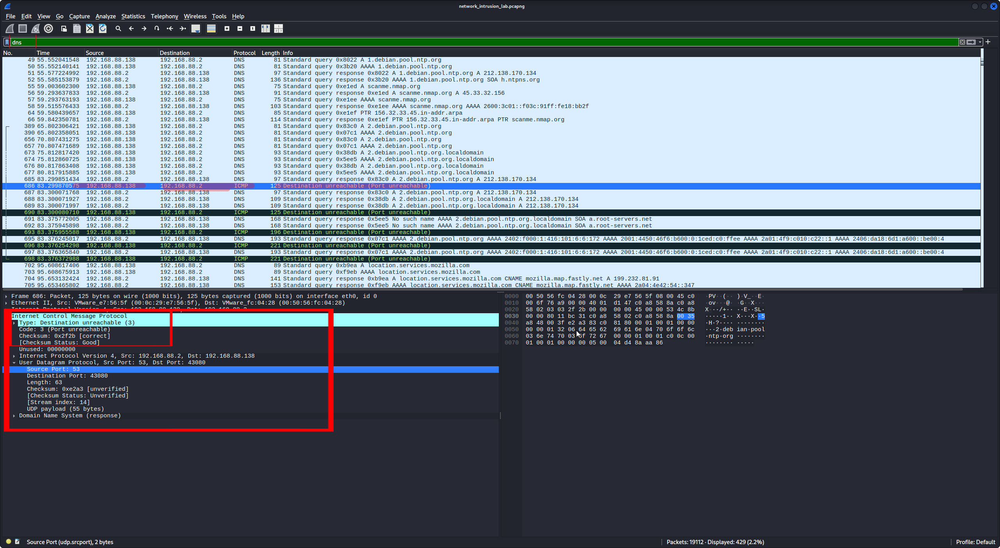
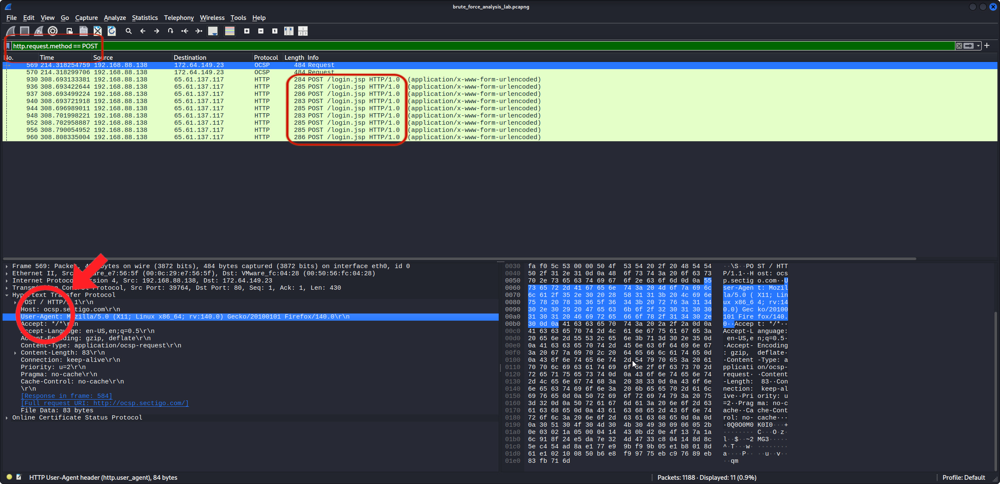
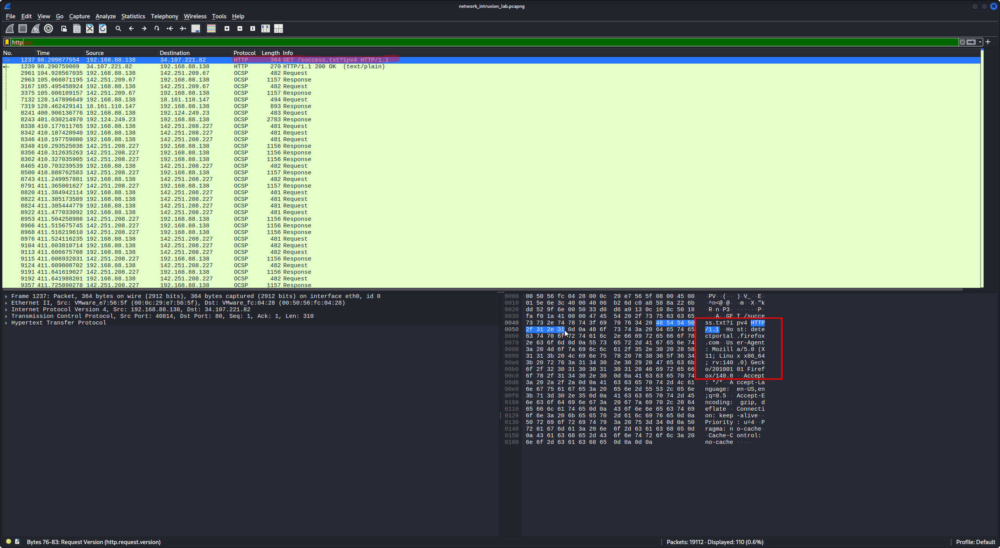
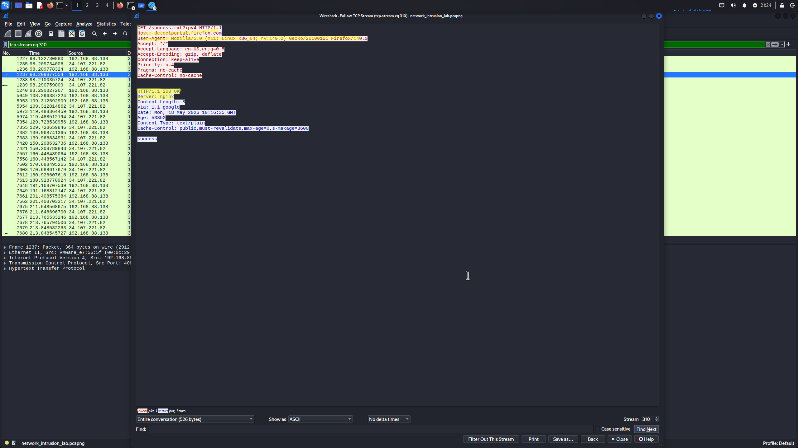

# Network Traffic Analysis: Brute Force Detection & SOC Lab

## Table of Contents
- [Project Overview](#project-overview)
- [Skills & Tools](#skills--tools)
- [Investigation Workflow](#investigation-workflow)
- [Key Findings](#key-findings)
- [Wireshark Filters Used](#wireshark-filters-used)
- [SOC Analyst Perspective](#soc-analyst-perspective)
- [Incident Response & Mitigation](#incident-response--mitigation)
- [Lab Architecture](#lab-architecture)
- [Repository Structure](#repository-structure)

---

## Project Overview
This project demonstrates the practical application of network traffic analysis to detect and investigate a **Brute Force Attack**. Using **Wireshark** and **Kali Linux**, I simulated a real-world attack scenario, captured live traffic, and performed a forensic analysis of packets to identify security risks, tool signatures, and evidence of compromise.

## Skills & Tools
* **Operating System:** Kali Linux
* **Packet Analyzer:** Wireshark
* **Attack Tool:** THC Hydra
* **Protocols Analyzed:** HTTP, DNS, OCSP, ICMP.
* **Key Skills:** Network Monitoring, Traffic Filtering, Attacker Fingerprinting, Deep Packet Inspection (DPI).

---

## Investigation Workflow

### 1. Attack Execution (The Source)
I simulated a dictionary-based brute force attack using **Hydra** against an HTTP login form to generate malicious traffic patterns.
* **Evidence:** 

### 2. Reconnaissance Activity
Observed **ICMP Type 3** packets, indicating scanning activity before the attack phase.
* **Evidence:** 

### 3. Brute Force Detection
Isolated authentication attempts and identified the tool's digital signature via Deep Packet Inspection (DPI).
* **Forensic Evidence:** Identified the User-Agent string specifically linked to the **Hydra** tool.
* **Evidence:** 

### 4. Vulnerability Assessment (Plaintext Exposure)
Investigated the lack of encryption that allowed sensitive data to be exposed during transit.
* **Finding:** Sensitive paths and credentials were visible in **Plaintext** due to the use of insecure HTTP.
* **Evidence:** 

### 5. Incident Confirmation
Reconstructed the TCP Stream and found the "success" message, confirming a breach.
* **Evidence:** 


---


## Key Findings
- **Detected brute force attack activity** via high-frequency POST requests.
- **Identified Hydra attack signature** through Deep Packet Inspection (DPI).
- **Observed reconnaissance scanning behavior** using ICMP and DNS logs.
- **Detected plaintext exposure risk** due to insecure HTTP communication.
- **Captured malicious authentication attempts** and confirmed account compromise.

---

## Wireshark Filters Used
I used these specific filters to isolate and analyze the malicious traffic:

```wireshark
http.request.method == "POST" # To isolate login attempts
dns                          # To monitor name resolution
icmp                         # To detect scanning & unreachable hosts
tcp                          # To analyze session streams
ip.addr == [Target_IP]       # To focus on the victim machine
```
---


## Mitigation Recommendations
* **Enforce Encryption:** Transition to **HTTPS (TLS 1.3)**.
* **Account Lockout:** Implement strict lockout policies.
* **IDS/IPS:** Monitor for high-frequency POST requests and suspicious User-Agents.


## SOC Analyst Perspective
> **Strategic Insight:** This investigation demonstrates how packet analysis serves as a foundational skill for incident response. 
> 
> By meticulously analyzing traffic, SOC analysts can:
> * **Identify Attack Patterns:** Recognize brute force and reconnaissance activity before they escalate.
> * **Understand Attacker Behavior:** Map out the TTPs (Tactics, Techniques, and Procedures) used by threat actors.
> * **Proactive Defense:** Detect insecure communications (like plaintext protocols) and implement mitigation steps before a breach occurs.
> 
> Mastering these forensic techniques is essential for effective **Threat Hunting** and building a proactive security posture.


## Lab Architecture
The following diagram illustrates the flow of the attack and the strategic point where traffic was captured for analysis:

```text
[ Attacker Machine ]               [ Target Server ]
(Kali Linux + Hydra)               (Web Login Form)
         |                                |
         |------- Brute Force POST ------>|
         |                                |
         |<------- HTTP 200 (Success) ----|
         |               |                |
         |        [ Wireshark ]           |
         |    (Traffic Capture/DPI)       |
```

---

# Lessons Learned

This lab improved my understanding of:
- Network traffic analysis
- Brute force attack behavior
- Packet inspection using Wireshark
- HTTP authentication analysis
- Attacker identification through traffic patterns
- Importance of encrypted communications

---

# Conclusion

This project demonstrates how packet analysis and network monitoring can help detect brute force attacks and identify security weaknesses in web environments.

It also highlights the importance of proactive monitoring, encryption, and traffic-based threat detection in SOC operations. 

## 📂 Repository Structure

* [**captures**](./captures): Contains the raw PCAP file for further investigation.
* [**screenshots**](./screenshots): Annotated visual evidence of the forensic analysis.
* [**README.md**](./README.md): Professional project documentation and technical report.


